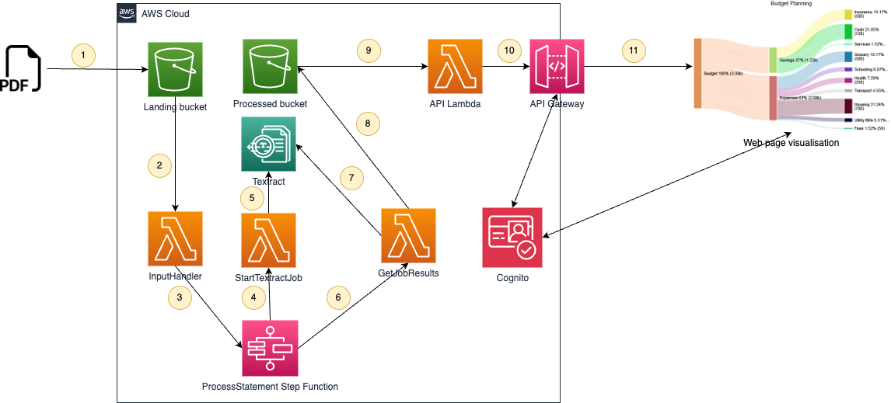
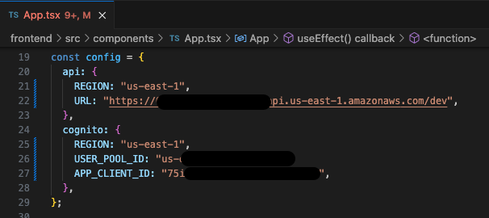

# Financial insight Textract
An application that provides insight to financial history by processing PDF bank statements into machine readable format using Textract, and providing intuitive summarised visualisation of spending habits.

The architecture is summarised in the following image




## Backend
The backend of the application consists of code that will take PDF bank statements uploaded to S3 (Commonwealth Bank Australia supported currently), use Textract to convert these into CSV, and store the result in S3.

The backend also contains a Lambda that will process the resulting CSV files (performing summarization and classification), and return the results. The API is protected by Cognito.

### Backend deployment 
1. Clone the Git repository, and prepare the Lambda deployment package by running the following command to zip the Lambda source code into a single .zip file:

    ```zip statement-insight.zip src/*.py classification.csv```

2. Navigate to the Amazon S3 console
3. Create an S3 bucket
4. Upload the Lambda deployment package you created in Step (1) Leave the file zipped as is
5. Once the Lambda deployment package has been placed in S3, launch this CloudFormation Template by navigating to the CloudFormation console, and clicking the Create stack button and selecting the **With new resources (standard)** option.
6. Select the Template is ready and Upload a template file radio button options as shown in the following figure, and then click **Choose file** and choose the file named `cloudFormation.yml` from the repository.
7. In the **Specify Stack Details** screen, under the **Parameters** section, do the following:
    * Update the Postfix parameter value to a unique postfix for your bucket names. This postfix will ensure the stack's bucket names are globally unique
    * Update the DeploymentBucket parameter value to the name of the bucket you uploaded the Lambda deployment package to in Step (4)
    * Update the Stage parameter to provide a stage name for your deployment

8. Choose **Create stack** to create the resources for the statement processing pipeline
9. Once complete, navigate to the **Outputs** tab of the CloudFormation stack where you will find
* The name of the S3 landing bucket that has been created
* The URL of the API endpoint that has been created
* The Cognito user pool id
* The Cognito app client id

## Frontend
The frontend of the application is a simple React page protected by Cognito that queries the backend API and displays the results in both a Sankey chart and searchable tabular structure.

### Configuring the frontend
Before running the frontend, update the file `frontend/src/components/App.tsx` with the configuration parameters for the API endpoint, Cognito user pool id, and Cognito app id from the backend CloudFormation stack as shown in the following figure



### Running the frontend
You can run the frontend locally by running the following commands in the `frontend` directory

```
npm ci
npm run start
```

### Deploying the frontend
To deploy the frontend (for example to S3), first build the assets by running the following command

```
npm run build
```

And copy the artifacts from the directory `www` to your hosting mechanism of choice
